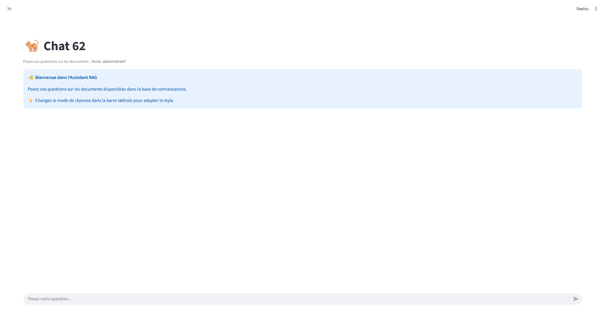
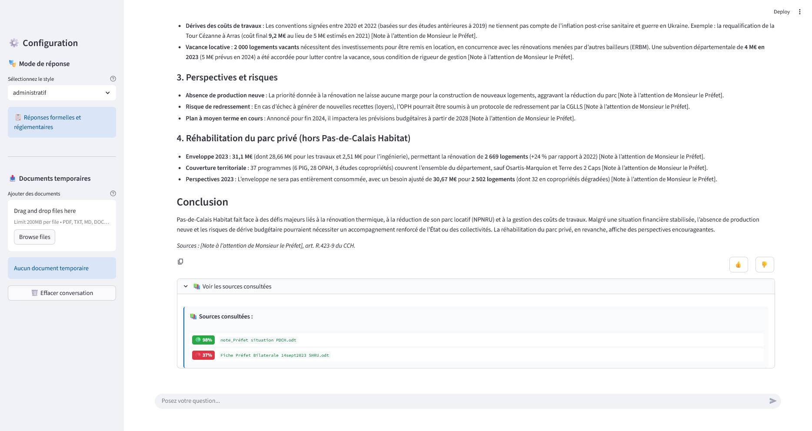
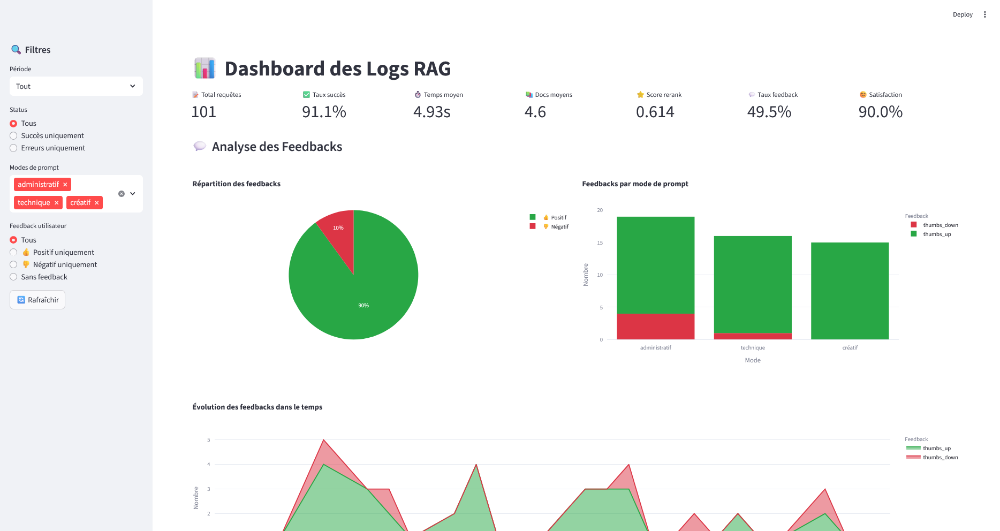

# Vue d'ensemble synthétique

## Qu'est-ce que Chat de Calais ?

- **Système RAG** (Retrieval-Augmented Generation) pour interroger des bases documentaires
- Utilisation des modèles **ALBERT** (API Etalab) pour :
  - Embeddings
  - Génération de texte
  - Reranking
- Interface utilisateur **Streamlit**

## Architecture globale

```{mermaid}
graph TD
    A[Utilisateur] --> B[Interface Streamlit]
    B --> C[Pipeline RAG]
    C --> D[Base ChromaDB]
    D --> E[Documents indexés]
    C --> F[API ALBERT]
    F --> G[Modèles IA]
```

## Fonctionnalités clés

- Indexation incrémentale des documents
- Pipeline RAG avec HyDE et reranking
- 3 modes de réponse (Administratif, Technique, Créatif)
- Traçabilité complète des requêtes
- Feedback utilisateur intégré

# Architecture détaillée

## Pipeline RAG en 4 étapes

```{mermaid}
graph LR
    A[Question] --> B[HyDE]
    B --> C[Retrieval 30 docs]
    C --> D[Reranking Top 5]
    D --> E[Génération LLM]
    E --> F[Réponse]
```

## Module d'indexation

- **Formats supportés** : PDF, DOCX, ODT, TXT, MD, HTML
- **Processus** :
  1. Scan du dossier `./documents`
  2. Calcul des hash MD5
  3. Détection des changements
  4. Mise à jour incrémentale ChromaDB
  5. Sauvegarde métadonnées

## Technologies utilisées

| Composant | Technologie | Rôle |
|-----------|-------------|------|
| Framework RAG | LangChain | Chaining de modèles |
| Base vectorielle | ChromaDB | Stockage des embeddings |
| Interface | Streamlit | UI interactive |
| Logging | SQLite | Traçabilité |
| Modèles IA | ALBERT API | Embeddings, LLM, Reranking |
| Visualisation | Plotly | Graphiques interactifs |

# Implémentation technique

## Configuration principale

```python
# config.py
ALBERT_API_KEY = os.getenv("ALBERT_API_KEY", "")
ALBERT_BASE_URL = "https://albert.api.etalab.gouv.fr/v1"

EMBEDDINGS_MODEL = "embeddings-small"
LLM_MODEL = "albert-large"
RERANK_MODEL = "rerank-small"

CHUNK_SIZE = 2000
CHUNK_OVERLAP = 400
RAG_TOP_K_DOCS = 5
RAG_TOP_N_RETRIEVAL = 30
```

## Exemple de code - Pipeline RAG

```python
# rag_pipeline.py
def rag_query(query: str, retriever, llm, mode: str = None):
    # 1. HyDE - Génération document hypothétique
    hyde_query = generate_hyde(query, llm)
    
    # 2. Retrieval - 30 documents
    docs_initial = retriever.invoke(hyde_query)
    
    # 3. Reranking - Top 5
    docs_final = rerank_documents(query, docs_initial, top_k=5)
    
    # 4. Génération réponse
    context = "\n\n".join([d.page_content for d in docs_final])
    answer = llm.generate(context + query)
    
    return {"answer": answer, "sources": sources}
```

## Applications Streamlit

- Le chatbot
- Dashboard de logs


## Application de chat

::: {.columns}
::: {.column width="50%"}


- Chat interactif avec historique
- Sélection du mode de prompt
- Upload de documents temporaires
- Feedback utilisateur (👍/👎)
- Affichage des sources

:::

::: {.column width="50%"}



:::
:::


## Application de chat

Un exemple de réponse




## Dashboard de logs

::: {.columns}
::: {.column width="50%"}

- Métriques principales
- Visualisations interactives
- Filtres par période, status, mode
- Analyse des feedbacks utilisateurs


:::

::: {.column width="50%"}



:::
:::

## Base de données de logs {.scrollable}

::: {.columns}
::: {.column width="50%"}
### Schéma SQLite

- `rag_queries` table avec 15+ champs
- Traçabilité complète : requêtes, réponses, scores, temps, feedbacks
- Statistiques et analyses intégrées

:::

::: {.column width="50%"}

::: {.small}
| Champ | Description |
|-------|-------------|
| `id` | Identifiant unique |
| `timestamp` | Date et heure |
| `user_query` | Question utilisateur |
| `hyde_query` | Requête HyDE |
| `retrieved_docs_count` | Docs récupérés |
| `reranked_docs_count` | Docs rerankés |
| `final_answer` | Réponse finale |
| `sources` | Sources |
| `rerank_scores` | Scores reranking |
| `execution_time_seconds` | Temps exécution |
| `error` | Erreurs |
| `retrieved_docs_details` | Détails docs récupérés |
| `reranked_docs_details` | Détails docs rerankés |
| `prompt_mode` | Mode prompt |
| `user_feedback` | Feedback |
| `feedback_timestamp` | Date feedback |
:::
:::
:::


## Une documentation à plusieurs niveaux 

### Un document dédié


## Une documentation à plusieurs niveaux 

### Des fonctions commentées

```python

def rag_query(
    query: str, retriever, llm, logger=None, top_k: int = None, mode: str = None
):
    """
    Exécute une requête RAG complète avec le mode de prompt configuré.

    Args:
        query: Question de l'utilisateur
        retriever: Retriever ChromaDB
        llm: Modèle LLM
        logger: Logger optionnel
        top_k: Nombre de documents finaux
        mode: Mode de prompt à utiliser (override config.PROMPT_MODE)

    Returns:
        dict: Résultat avec answer, sources, scores, etc.
    """
    start_time = time.time()
    top_k = top_k or config.RAG_TOP_K_DOCS

    # Déterminer le mode à utiliser
    prompt_mode = mode or config.PROMPT_MODE

    # ✅ Initialiser les variables au début pour éviter UnboundLocalError
    hyde_query = query
    docs_initial = []
    docs_final = []

    try:
        if config.VERBOSE:
            print(f"\n{'=' * 60}")
            print(f"Nouvelle requête (mode: {prompt_mode})")
            print(f"{'=' * 60}")
            print(f"Question: {query}\n")

        # 1. HyDE
        if config.VERBOSE:
            print("1/4: Génération HyDE...")
        hyde_query = generate_hyde(query, llm)
        ...

```


# Conclusion

## Points forts du système

- **Modularité** : Modules indépendants et réutilisables
- **Extensibilité** : Ajout facile de nouveaux formats et fonctionnalités
- **Traçabilité** : Logging complet pour analyse et amélioration
- **Flexibilité** : 3 modes de réponse adaptés à différents usages
- **Performance** : Pipeline optimisé avec HyDE et reranking

## Perspectives d'évolution

- Intégration/modifications des modèles
- Amélioration de l'interface utilisateur
- Amélioration des paramètres (préprompts, filtres, seuils, etc.)
- Optimisation des performances

## Questions ?

Merci pour votre attention !

*Contact : romain.cadot@cerema.fr*
