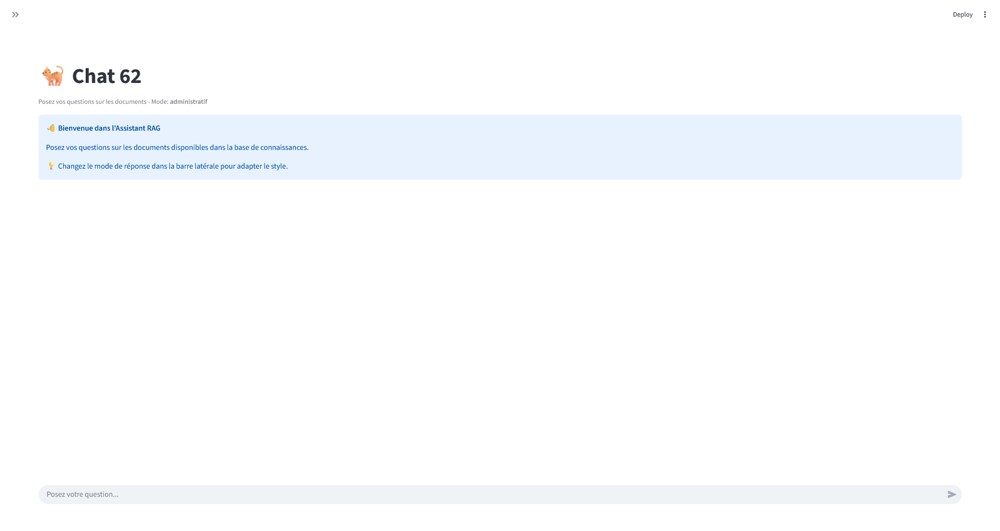
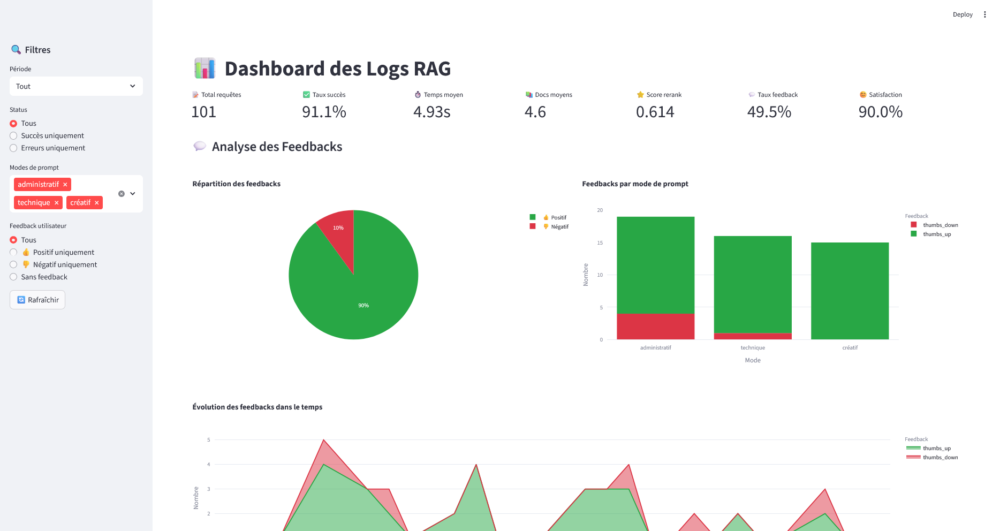

# Contexte

## Un assistant pour les notes de la DDTM

- Les notes de la DDTM du Pas-de-Calais s'accumulent en versions successives, en plusieurs formats
- **Chat de Calais** : un assistant RAG (Streamlit) qui répond à partir de ces documents
- Modèles **Albert** (API Etalab) : réponse, embeddings, rerank et OCR
- Chaque réponse cite ses sources

## Le corpus

| | |
|---|---|
| Fichiers | 130 |
| Passages indexés | 855 |
| Passages issus de l'OCR | 199 |
| Réindexation complète | environ 20 secondes (cache OCR) |

# Chaîne de traitement

## De la question à la réponse

```{mermaid}
%%| fig-width: 10
flowchart LR
    A[Question] --> B[Reformulation]
    B --> C[HyDE, optionnel]
    C --> D[Recherche hybride]
    D --> E[Dédoublonnage]
    E --> F[Rerank]
    F --> G[Seuil et plafond]
    G --> H[Voisins]
    H --> I[Réponse citée]
```

## Formats et OCR

- PDF, DOCX, **DOC** (lecteur Python pur), ODT, TXT, MD, HTML, **EML** avec pièces jointes
- Images PNG, JPG, TIFF lues par OCR
- Page PDF scannée si moins de 50 caractères de texte
- Images insérées dans une page de texte également lues
- Résultats mis en cache sur disque

## Documents similaires

- Une même note existe en plusieurs versions et formats
- Métadonnées tirées du chemin : date de réunion, version validée, titre, famille
- Passages quasi identiques regroupés
- Représentant retenu : version validée, puis la plus récente
- Les autres restent visibles sous la mention « aussi dans »

# Recherche et pertinence

## Recherche hybride

::: {.columns}
::: {.column width="50%"}
**Par le sens**

Recherche vectorielle sur la question (ou sur une réponse hypothétique si HyDE est activé)
:::
::: {.column width="50%"}
**Par les mots**

BM25 sur la question d'origine, pour les références exactes
:::
:::

Les deux classements sont fusionnés (Reciprocal Rank Fusion, k = 60).

## Rerank et seuil de pertinence

- Les candidats sont triés par le modèle de rerank Albert
- Seuil de 0,03 : sans passage au-dessus, **aucun appel au modèle** et un message explicite
- Au plus 2 passages par document, 5 passages au total
- Passages élargis à leurs voisins

## HyDE : facultatif

- Désactivé par défaut, disponible en option
- Aucun gain mesuré dès lors que la recherche hybride est active
- Environ 15 s d'attente en plus par question, contre 0,4 s sans

## Questions de suivi

- Les 3 derniers échanges servent à reformuler la question
- « Et pour Calais ? » devient une question autonome
- Une question qui change de sujet est laissée telle quelle

# Interface

## Une interface qui explique son travail

- Statut animé : étapes, détails, chronomètre en direct
- « Sources trouvées en x s », puis « Réponse en y s »
- Trois modes de réponse : administratif, technique, créatif
- Documents temporaires interrogés avec la base ou seuls
- Retours pouce haut et pouce bas

## Sources citées

- Onglets numérotés comme les citations [n]
- Extrait utilisé, date, statut, pertinence, mention OCR
- Aperçu de la page PDF et ouverture du document
- Avertissement si les sources sont peu pertinentes
- Filtres : période de réunion, versions validées

## Captures de l'ancienne interface

::: {.callout-warning}
Ces captures montrent la version précédente de l'interface.
:::

::: {.columns}
::: {.column width="50%"}

:::
::: {.column width="50%"}

:::
:::

# Exploitation et qualité

## Paramétrage sans code

- Un fichier `parametres.yaml` commenté : modèles, recherche, OCR, textes, prompts
- Clé d'API et surcharges dans `.env`
- Validation au démarrage : type, clé manquante, variables de prompt, numéro de ligne en cas d'erreur
- Certains réglages imposent une réindexation

## Évaluation : la méthode

- 55 questions : 49 avec réponse dans un document connu, 6 hors sujet
- Indicateurs : succès, rappel, MRR, rejet des hors sujet, documents distincts, doublons, durée
- `evaluate.py` désactive une étape à la fois (HyDE, hybride, rerank, dédoublonnage)
- `--seuils` simule plusieurs seuils sans nouvel appel
- Rapport complet : `evaluation/rapport_evaluation.md`

## Évaluation : résultats

- Référence : 49 questions documentées sur 49 trouvées, 6 hors sujet sur 6 rejetées, MRR de 0,97, 0,4 s par recherche
- Sans recherche hybride : 18 % de succès
- Sans rerank : aucun hors sujet rejeté, MRR de 0,48
- Sans dédoublonnage : 1,05 doublon par réponse (0 avec)
- Avec HyDE : MRR de 0,98 mais 15 s, d'où sa désactivation
- Une trentaine de chiffres des réponses contrôlés, tous exacts
- Limite : questions rédigées avec le vocabulaire des documents

## Qualité et tests

- Environ 100 tests `pytest`, API Albert simulée
- Couverture : paramètres, corpus, OCR, chargeurs, recherche, pipeline, évaluation
- Intégration continue GitHub Actions et GitLab CI
- Journal SQLite des requêtes et tableau de bord

# Conclusion

## Suites possibles

- Exploiter le rapport d'évaluation pour ajuster les seuils et le plafond
- Étendre le corpus et le jeu de questions
- Tester d'autres modèles Albert
- Exploiter les retours des utilisateurs du journal

## Questions ?

Merci pour votre attention.

*Contact : romain.cadot@cerema.fr*
